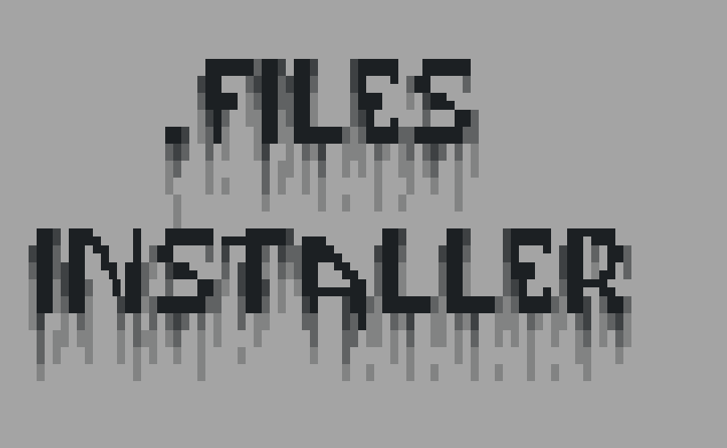
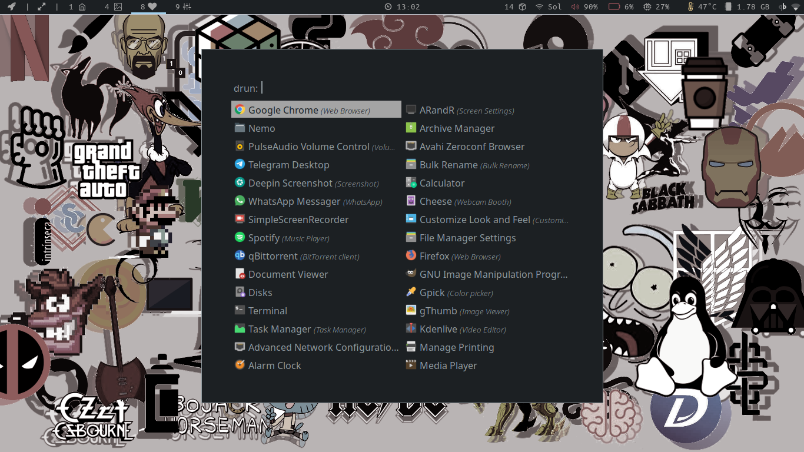
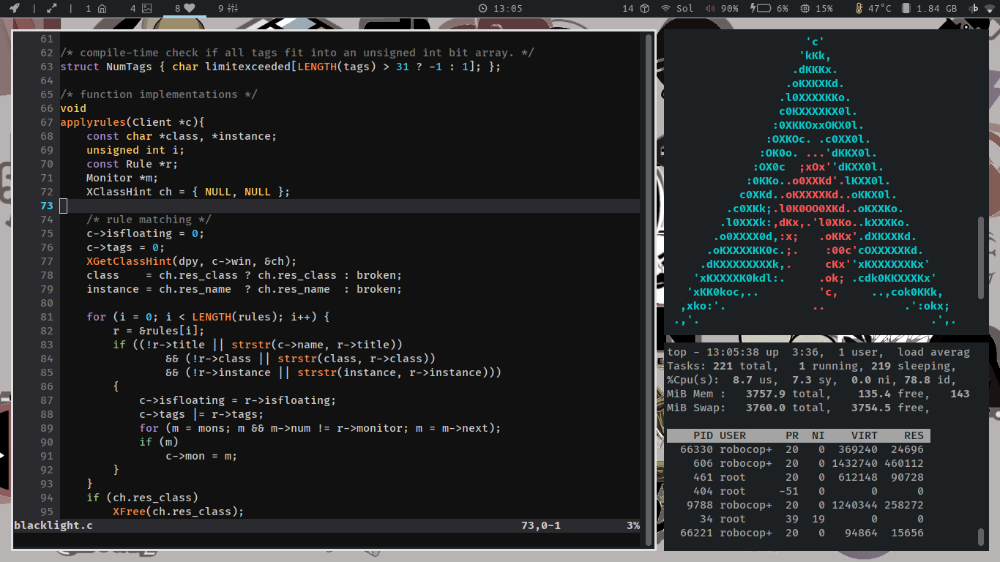

# .Files Installer



This is my config files colection, and it's all on `skel` folder, this did made for ArchLinux, so will'nt to works on other systems without an chage of the `install.sh` file, good luck for the gui that will to try it.

## Install

Is just run the next commands:

> You will need of `zsh` installed and a `sudo` user for run the script

```zsh
$ git clone http://github.com/RoboCopGay/.files RoboCopDotFiles
$ cd RoboCopDotFiles
$ ./install.sh
```

# Screenshots




